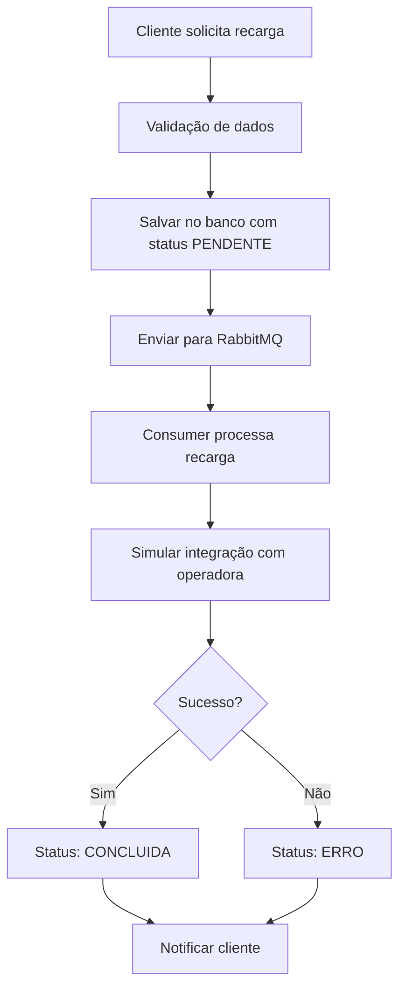

# 📱 API de Recarga de Celular

Sistema completo de API para recarga de celular com processamento assíncrono usando Spring Boot, PostgreSQL e RabbitMQ.

## 🚀 Funcionalidades

### ✅ **Implementadas:**
- **Cadastro de Clientes** - CRUD completo com validações
- **Métodos de Pagamento** - Gerenciamento de cartões, PIX, boleto
- **Operadoras** - Vivo, TIM, Claro, Oi, Algar, Sercomtel
- **Recargas** - Sistema completo com processamento assíncrono
- **RabbitMQ** - Processamento em background
- **OpenAPI/Swagger** - Documentação automática da API
- **Docker** - Containerização completa
- **PostgreSQL** - Banco de dados relacional
- **Validações** - Bean Validation em todas as entidades

## 🏗️ Arquitetura

```
┌─────────────────┐    ┌─────────────────┐    ┌─────────────────┐
│   Controllers   │    │    Services     │    │  Repositories   │
│   (REST APIs)   │───▶│ (Business Logic)│───▶│  (Data Access)  │
└─────────────────┘    └─────────────────┘    └─────────────────┘
         │                       │                       │
         ▼                       ▼                       ▼
┌─────────────────┐    ┌─────────────────┐    ┌─────────────────┐
│   OpenAPI       │    │   RabbitMQ      │    │   PostgreSQL    │
│   (Swagger)     │    │  (Messaging)    │    │   (Database)    │
└─────────────────┘    └─────────────────┘    └─────────────────┘
```

## 🛠️ Tecnologias

- **Java 21**
- **Spring Boot 3.5.6**
- **Spring Data JPA**
- **Spring AMQP (RabbitMQ)**
- **PostgreSQL**
- **Docker & Docker Compose**
- **OpenAPI 3 (Swagger)**
- **Bean Validation**
- **Maven**

## 📋 Pré-requisitos

- Java 21+
- Maven 3.6+
- Docker & Docker Compose
- Git

## 🚀 Como Executar

### **Opção 1: Docker Compose (Recomendado)**

```bash
# 1. Clone o repositório
git clone <seu-repositorio>
cd apiRecarga

# 2. Execute com Docker Compose
docker-compose up -d

# 3. Acesse a aplicação
# API: http://localhost:8080
# Swagger: http://localhost:8080/swagger-ui.html
# RabbitMQ Management: http://localhost:15672 (guest/guest)
```

### **Opção 2: Execução Local**

```bash
# 1. Inicie PostgreSQL e RabbitMQ
docker-compose up -d postgres rabbitmq

# 2. Compile e execute
mvn clean compile
mvn spring-boot:run

# 3. Acesse a aplicação
# API: http://localhost:8080
# Swagger: http://localhost:8080/swagger-ui.html
```

## 📚 Documentação da API

### **Swagger UI**
Acesse: http://localhost:8080/swagger-ui.html

### **Endpoints Principais**

#### **Clientes**
- `POST /api/v1/clientes` - Criar cliente
- `GET /api/v1/clientes/{id}` - Buscar cliente
- `GET /api/v1/clientes` - Listar clientes
- `PUT /api/v1/clientes/{id}` - Atualizar cliente
- `DELETE /api/v1/clientes/{id}` - Desativar cliente

#### **Recargas (Core do Sistema)**
- `POST /api/v1/recargas` - **Criar recarga**
- `GET /api/v1/recargas/{id}` - Buscar recarga
- `GET /api/v1/recargas/cliente/{clienteId}` - Listar recargas do cliente
- `PUT /api/v1/recargas/{id}/status` - Atualizar status
- `PUT /api/v1/recargas/{id}/cancelar` - Cancelar recarga
- `GET /api/v1/recargas/estatisticas` - Estatísticas

#### **Métodos de Pagamento**
- `POST /api/v1/metodos-pagamento` - Criar método
- `GET /api/v1/metodos-pagamento/cliente/{clienteId}` - Listar métodos do cliente
- `PUT /api/v1/metodos-pagamento/{id}/definir-padrao` - Definir como padrão

#### **Operadoras**
- `GET /api/v1/operadoras` - Listar operadoras
- `GET /api/v1/operadoras/ativas` - Listar ativas

## 🔄 Fluxo de Recarga



## 📊 Status das Recargas

- **PENDENTE** - Aguardando processamento
- **PROCESSANDO** - Sendo processada
- **CONCLUIDA** - Recarga realizada com sucesso
- **ERRO** - Falha no processamento
- **CANCELADA** - Cancelada pelo cliente

## 🗄️ Banco de Dados

### **Entidades Principais:**
- **Cliente** - Dados pessoais
- **Operadora** - Vivo, TIM, Claro, etc.
- **MetodoPagamento** - Cartão, PIX, boleto
- **Recarga** - Transação de recarga

### **Relacionamentos:**
- Cliente → Métodos de Pagamento (1:N)
- Cliente → Recargas (1:N)
- Operadora → Recargas (1:N)
- Método de Pagamento → Recargas (1:N)

## 🐰 RabbitMQ

### **Configuração:**
- **Exchange:** `recarga.exchange`
- **Queue:** `recarga.queue`
- **Routing Key:** `recarga.processar`

### **Fluxo:**
1. Producer envia recarga para fila
2. Consumer processa em background
3. Simula integração com operadora (2-5 segundos)
4. Atualiza status no banco

## 🐳 Docker

### **Serviços:**
- **postgres** - Banco de dados
- **rabbitmq** - Message broker
- **api-recarga** - Aplicação Spring Boot

### **Portas:**
- 8080 - API
- 5432 - PostgreSQL
- 5672 - RabbitMQ
- 15672 - RabbitMQ Management

## 🧪 Testando a API

### **1. Criar Cliente**
```bash
curl -X POST http://localhost:8080/api/v1/clientes \
  -H "Content-Type: application/json" \
  -d '{
    "nome": "João Silva",
    "email": "joao@email.com",
    "telefone": "(11)99999-9999",
    "cpf": "123.456.789-00"
  }'
```

### **2. Criar Método de Pagamento**
```bash
curl -X POST http://localhost:8080/api/v1/metodos-pagamento \
  -H "Content-Type: application/json" \
  -d '{
    "clienteId": 1,
    "tipoPagamento": "CARTAO_CREDITO",
    "descricao": "Cartão Visa",
    "ultimosDigitos": "1234",
    "padrao": true
  }'
```

### **3. Criar Recarga**
```bash
curl -X POST http://localhost:8080/api/v1/recargas \
  -H "Content-Type: application/json" \
  -d '{
    "clienteId": 1,
    "operadoraId": 1,
    "metodoPagamentoId": 1,
    "numeroCelular": "11999999999",
    "valor": 20.00
  }'
```

## 📈 Monitoramento

### **Health Checks:**
- http://localhost:8080/actuator/health
- http://localhost:8080/actuator/info

### **RabbitMQ Management:**
- http://localhost:15672
- Usuário: `guest`
- Senha: `guest`

## 🔧 Configuração

### **application.yml**
```yaml
server:
  port: 8080

spring:
  datasource:
    url: jdbc:postgresql://localhost:5432/recargasdb
    username: postgres
    password: postgres
  
  rabbitmq:
    host: localhost
    port: 5672
    username: guest
    password: guest
```

## 🚀 Próximos Passos

### **Melhorias Futuras:**
- [ ] Integração real com operadoras
- [ ] Sistema de notificações (email/SMS)
- [ ] Cache com Redis
- [ ] Logs estruturados
- [ ] Métricas com Prometheus
- [ ] Testes automatizados
- [ ] CI/CD pipeline

## 📝 Licença

MIT License - veja o arquivo LICENSE para detalhes.

## 👥 Contribuição

1. Fork o projeto
2. Crie uma branch para sua feature
3. Commit suas mudanças
4. Push para a branch
5. Abra um Pull Request

---

**Desenvolvido com ❤️ usando Spring Boot**
